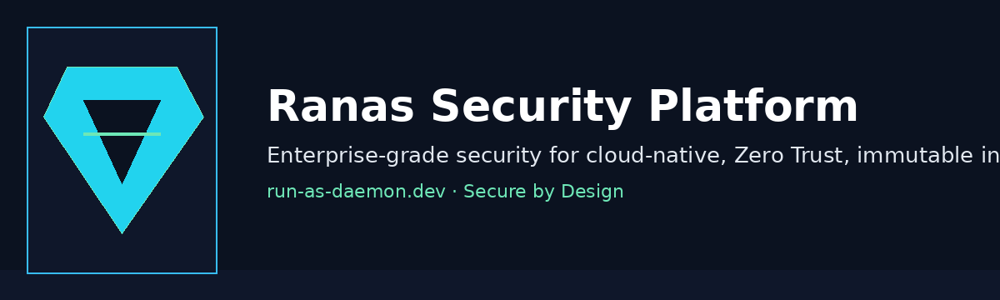
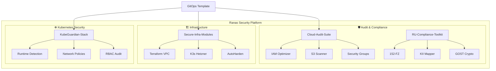
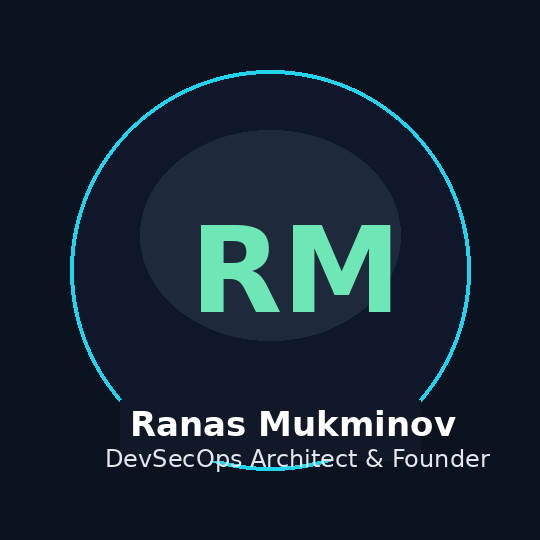

# Ranas Security Platform

**Enterprise-Grade Security Tools for Cloud-Native Infrastructure**

The Ranas Security Platform is a curated ecosystem of security tools built by Ranas Mukminov to help DevSecOps teams, FinTech CTOs, and security engineers ship and operate secure-by-design systems. It unifies cloud posture management, Kubernetes runtime protection, compliance automation, and hardened infrastructure modules under a single governance model.

Modern cloud stacks suffer from misconfigurations, fragmented visibility, and compliance drift. The platform provides repeatable GitOps workflows, pre-hardened infrastructure blueprints, and runtime controls that map to Zero Trust and immutable infrastructure principles. Each component is modular, API-first, and designed to integrate cleanly into existing CI/CD pipelines.

Ranas Security Platform accelerates cloud-native teams that need to satisfy regulatory requirements (CIS, SOC2, 152-FZ), reduce attack surface, and respond quickly to runtime threats—without sacrificing developer velocity.

## Architecture

## Products
| Component | Description | Status | Link |
|-----------|-------------|--------|------|
| Cloud-Audit-Suite | AWS/GCP/Azure security auditing CLI | ✅ Active | [Repository](https://github.com/ranas-mukminov/Cloud-IAM-Optimizer) |
| KubeGuardian-Stack | Kubernetes runtime security | ✅ Active | [Repository](https://github.com/ranas-mukminov/KubeGuardian-Core) |
| Secure-Infra-Modules | Terraform/security hardening modules | 🚧 Beta | [Repository](https://github.com/ranas-mukminov/AutoHarden-Toolkit) |
| RU-Compliance-Toolkit | Russian compliance automation (152-FZ, KII) | ✅ Active | [Repository](https://github.com/ranas-mukminov/152fz-compliance-as-code) |
| Secure-K3s-GitOps-Template | Production-ready K3s template | ✅ Active | [Access Request](https://run-as-daemon.dev/enterprise) |

## Features
- 🔍 Multi-cloud security auditing (AWS, GCP, Azure)
- 🛡️ Kubernetes runtime threat detection
- 📋 Compliance automation (CIS, SOC2, 152-FZ)
- 🏗️ Infrastructure-as-Code security modules
- 🚀 GitOps-ready deployment templates

## Quick Links
- Cloud-Audit-Suite: [Repository](https://github.com/ranas-mukminov/Cloud-IAM-Optimizer) · [Docs](docs/architecture.md#system-overview)
- KubeGuardian-Stack: [Repository](https://github.com/ranas-mukminov/KubeGuardian-Core) · [Runtime Controls](docs/architecture.md#component-interactions)
- Secure-Infra-Modules: [Repository](https://github.com/ranas-mukminov/AutoHarden-Toolkit) · [Roadmap](docs/roadmap.md)
- RU-Compliance-Toolkit: [Repository](https://github.com/ranas-mukminov/152fz-compliance-as-code) · [Compliance Mapping](docs/architecture.md#deployment-models)
- Secure-K3s-GitOps-Template: [Access Request](https://run-as-daemon.dev/enterprise) · [GitOps Flow](docs/architecture.md#component-interactions)

## 🏢 Enterprise

Need custom implementation or dedicated support?

- ✅ Custom security audits
- ✅ On-premise deployment
- ✅ 24/7 support with SLA
- ✅ Compliance consulting (SOC2, ISO27001, 152-FZ)
- ✅ Training & workshops

👉 **Contact:** https://run-as-daemon.dev/enterprise
📅 **Book a call:** https://calendly.com/ranas-security

## Author

- **Ranas Mukminov** — DevSecOps Architect & Founder
- Website: https://run-as-daemon.dev
- LinkedIn: https://www.linkedin.com/in/ranas-mukminov/
- GitHub: https://github.com/ranas-mukminov

## License
MIT License — see [LICENSE](LICENSE).
