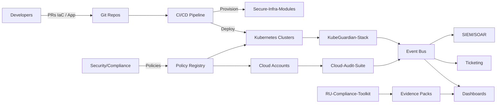
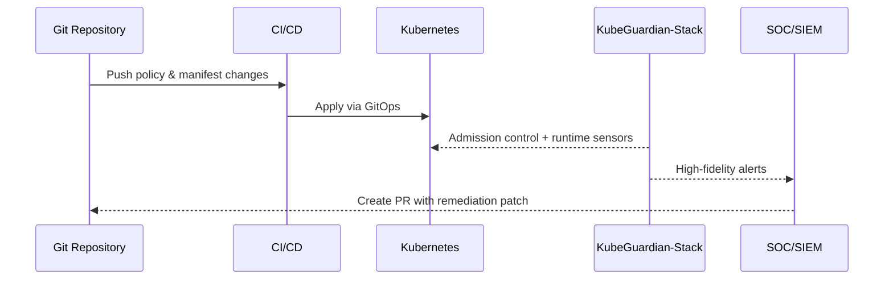

# Architecture

## System Overview
Ranas Security Platform unifies audit, compliance, runtime protection, and hardened infrastructure into a modular stack. Each component is API-first, GitOps-ready, and ships with policy baselines aligned to Zero Trust and immutable infrastructure principles. Tooling is built to integrate with CI/CD, SIEM/SOAR, and ticketing systems for closed-loop remediation.

## Component Interactions
- **GitOps Template** orchestrates desired state across clouds and Kubernetes clusters, wiring secrets, policy bundles, and observability defaults.
- **Cloud-Audit-Suite** runs scheduled and on-demand posture checks for AWS/GCP/Azure accounts; emits findings to the central events bus and opens remediation PRs against IaC definitions.
- **RU-Compliance-Toolkit** maps assets to 152-FZ/KII/GOST controls, generating audit evidence packs and compliance dashboards.
- **Secure-Infra-Modules** provides hardened Terraform modules (VPC, K3s on Hetzner, OS hardening) with guardrails enforced by policy-as-code.
- **KubeGuardian-Stack** enforces runtime detection, network policy baselines, and RBAC audits with admission controls and runtime sensors.
- **Shared Services** include identity (OIDC/JWT), logging/telemetry exporters, and a policy bundle registry consumed by all components.

## Data Flow

### Runtime Control Loop

## Deployment Models
- **SaaS:** Managed control plane hosted by Ranas Security Stack; agents and scanners run in customer clouds/clusters with outbound-only connectivity. Ideal for teams wanting minimal ops overhead and fast onboarding.
- **Self-hosted:** All components deployed in the customer environment via GitOps template. Secrets managed through customer KMS/HSM; audit events route to customer-owned SIEM. Suitable for regulated sectors with strict data residency.
- **Hybrid:** Control plane metadata hosted by Ranas; evidence stores, SIEM, and scanners reside in customer accounts. Balances velocity with residency requirements and simplifies upgrades via managed policy bundle releases.

## Assurance & Hardening Practices
- Default policies align with CIS Benchmarks, SOC2 controls, and 152-FZ/GOST requirements.
- Immutable build artifacts with provenance (SLSA-aligned) and reproducible builds for scanners and agents.
- Extensive preflight checks in CI/CD (OPA/Conftest) before applying infrastructure changes.
- Defense-in-depth: runtime sensors, network micro-segmentation, and continuous RBAC audits.
- Telemetry exported via OpenTelemetry with integration guides for Splunk, ELK, and Grafana Loki.
